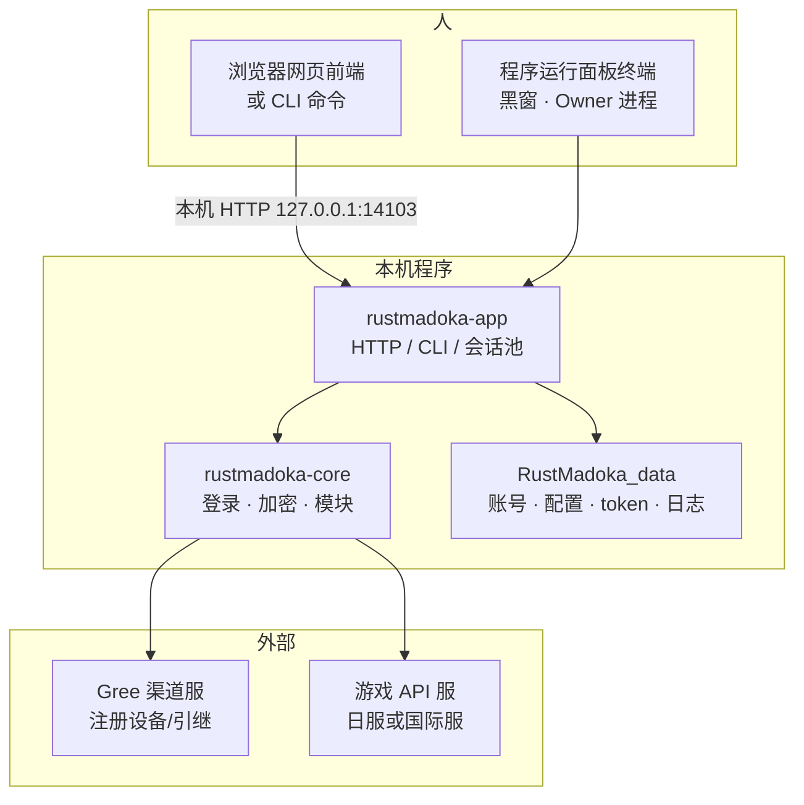
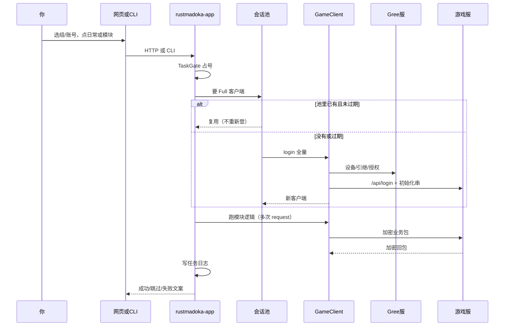
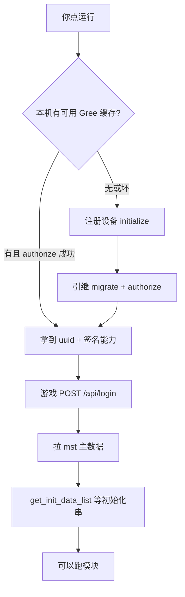
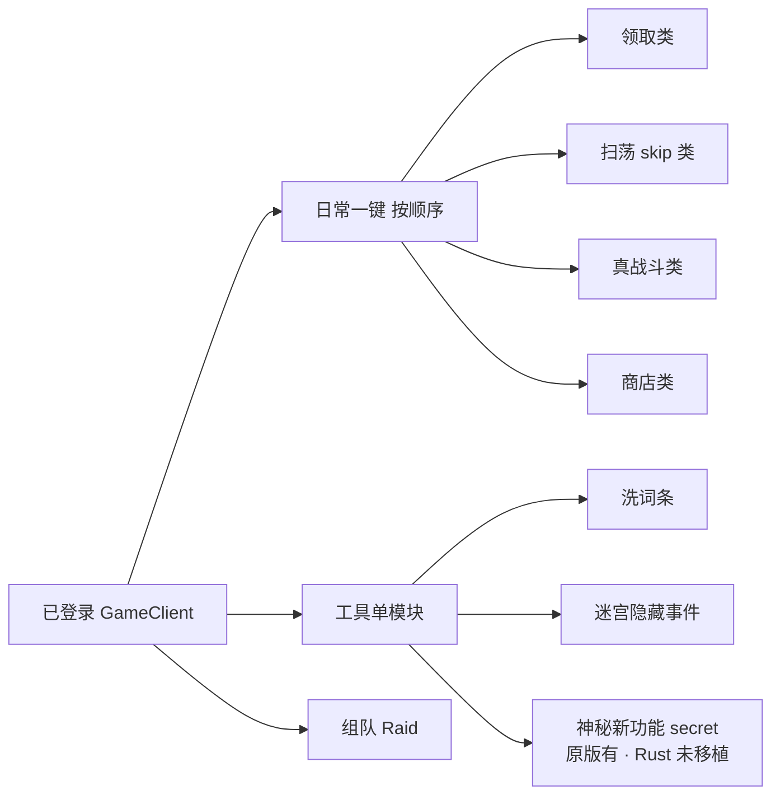
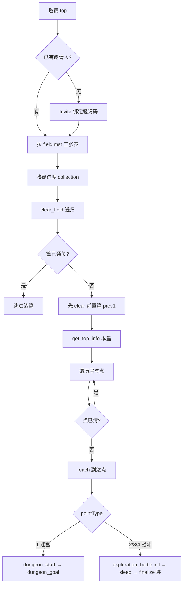

# 人类向流程报告：从输入账号密码到全部功能（含神秘新功能）

| 项 | 内容 |
|----|------|
| **墙钟** | 2026-08-08 |
| **读者** | 主人与非程序员协作者；后继 AI 亦可当地图 |
| **失真声明** | **AI 整理，有可能出错和失真。** 以当前源码与 `archive/pre-rust-2026-08/autopcr` 为准；线上服字段可能增减。证据：`client.rs` · `gree.rs` · `modules/*` · wire 样本 · 技术文档 INIT/PROTOCOL。 |
| **范围** | Windows 端 RustMadoka（`RustMadoka.exe` / `_debug.exe`）+ 原版 Python 对照（尤其 **secret 神秘新功能** 尚未进 Rust） |
| **Inbound** | 主人 2026-08-08：从输密码到功能全流程；可预见对服通讯；发/收构成；可带 Windows 源结构与执行原理 |

---

## 0. 先用一张图看懂整机在干什么



**白话：**  
你输入的引继码和密码，先存在本机数据夹里。点「运行」时，程序先用 **Gree** 证明「我是这个号的设备」，再拿 **游戏服** 的会话，然后按功能一个个发业务请求。开发版还会把通讯录进 `wire/` 方便查。

---

## 1. Windows 端源文件结构与执行原理

### 1.1 目录角色（你双击的 exe 从哪来）

```text
C:\GrokProject\automadoka\
  RustMadoka.exe / RustMadoka_debug.exe   ← 交付物（脚本 build-win-dual 产出）
  RustMadoka_data\                        ← 运行数据（账号、配置、token、日志）
  crates\
    rustmadoka-core\     ← 协议与游戏业务（平台无关）
    rustmadoka-app\      ← Windows 宿主：CLI、HTTP、Owner、网页静态页
    rustmadoka-mobile\   ← Android 壳（JNI 起同一套 HTTP）
  crates\rustmadoka-app\static\index.html  ← 浏览器网页前端
  archive\pre-rust-2026-08\autopcr\      ← 原版 Python（只读对照）
```

### 1.2 core 里大致有什么

| 文件/目录 | 人话职责 |
|-----------|----------|
| `gree.rs` | 渠道登录：设备注册、引继、授权；产出 uuid + 签名用私钥 |
| `crypto.rs` | 游戏包：msgpack + AES；与 Python 对齐 |
| `client.rs` | **GameClient**：登录串 + 每次业务 `request` |
| `fingerprint.rs` | 版本指纹 `sm`（假装客户端版本） |
| `account.rs` | 用户组/账号存盘；layout2 旁路 |
| `mst.rs` | 主数据表缓存（关卡名、角色表等） |
| `modules/daily.rs` | 日常与多数单模块逻辑 |
| `modules/wash.rs` | 洗词条 |
| `modules/group_raid.rs` | 组队团战编排 |
| `wire.rs` | 开发版全量通讯录制 |
| `protocol.rs` / `domain.rs` | 分区命名空间（R2） |

### 1.3 app 里大致有什么

| 文件 | 人话职责 |
|------|----------|
| `main.rs` / `lib.rs` | 入口；解析 CLI |
| `http_server.rs` | 本机网页 API + 静态页 |
| `run_ops.rs` | 登录后跑日常/模块/导出/组队 |
| `session_pool.rs` | **同一引继 75 分钟内复用登录** |
| `task_gate.rs` | 同号不能并行两个打服任务 |
| `owner_lock.rs` | 同数据夹同机只能一个主程序 |
| `occupancy.rs` | 云盘/跨路径二次保险（心跳文件） |
| `task_log.rs` | 任务日志落盘 |
| `data_layout.rs` | 数据夹目录与 layout 版本 |

### 1.4 一次「点运行」在进程里怎么走



---

## 2. 从「输入账号密码」开始：两条线

### 2.1 线 A：只存到本机（还不打游戏服）

| 步骤 | 你做什么 | 程序做什么 | 是否联网 |
|------|----------|------------|----------|
| 1 | 打开 exe | Owner 起 HTTP，默认 `http://127.0.0.1:14103/` | 否（或静默查指纹） |
| 2 | 建用户组（可设组密码挡小孩） | 写 `RustMadoka_data/users/….json` | 否 |
| 3 | 添加卡片：引继码 + 游戏密码 + 日服/国际服 | 写入组内账号；明文组可镜像 `accounts/…/identity.json` | 否 |
| 4 | 勾选日常模块、填队伍/关卡等 | 写 config（可镜像到 `groups/…/settings.json`） | 否 |

**组密码 ≠ 游戏密码：**  
组密码只锁「谁能打开这个用户组」；游戏密码是引继对应的游戏账号密码。

### 2.2 线 B：真正连游戏（第一次点「获取信息 / 清日常 / 单模块」）

下面所有「游戏 API」在报文层都类似（见第 3 节）。先讲业务顺序。

---

## 3. 每一次游戏业务请求的「外壳」（发/收构成）

### 3.1 你「发出去」的东西（逻辑层）

程序先组一个 **业务 payload**（JSON 对象，字段随 API 变），再自动补：

| 字段 | 含义 |
|------|------|
| `lastHomeAccessTime` | 上次访问主页时间串（字符串） |
| `sm` | 版本指纹（假客户端版本条） |

再包成 **envelope（外层）**：

| 字段 | 含义 |
|------|------|
| `payload` | 上面的业务体 |
| `uuid` | Gree 设备/账号 uuid |
| `userId` | 游戏用户数字 id（登录后才有） |
| `sessionId` | 游戏会话 id（登录后才有） |
| `actionToken` | 常为 null |
| `ctag` | 常为 null |
| `actionTime` | 时间戳（与官方客户端同类算法） |

然后：

1. **msgpack** 序列化 envelope  
2. **AES-CBC** 加密（密钥来自游戏 PKLB 常量）  
3. 用 Gree 的 **RSA 私钥**对密文字节签名 → HTTP 头 **`x-post-signature`**  
4. `POST {游戏根地址}{路径}`，`Content-Type: application/x-msgpack`  
5. 其它头：时区、语言、Unity 版本等  

**日服根地址示例：** `https://api.mmme.pokelabo.jp`  
**国际服根地址示例：** `https://api-gl.mmme.pokelabo.jp`

### 3.2 你「收回来」的东西（逻辑层）

1. HTTP 状态：200 正常；428 常表示版本/指纹要更新；401 会话失效需重登  
2. 密文 → 解密 → 解包成 JSON，大致形状：

```text
{
  "payload": { ... 业务数据 ... },
  "errors": [ ... ]   // 非空 = 业务失败（程序会翻成跳过/中止/错误）
}
```

| 区域 | 常见内容 |
|------|----------|
| `payload` | 本 API 的结果：列表、次数、血量、奖励等 |
| `errors` | 业务码 + 消息；空数组 = 成功 |

**开发版**会把明文路径、payload、耗时等写入 `RustMadoka_data/wire/…`（查问题时用）。

---

## 4. 登录全链路（从密码到「可以跑功能」）



### 4.1 阶段 0：Gree 渠道（还不是游戏 API 包）

**目的：** 证明设备 + 引继，得到 `uuid` 和以后给游戏包签名的私钥。

| 顺序 | 动作 | 发过去（概念） | 收回来（概念） |
|------|------|----------------|----------------|
| 0.1 | 若有 token 缓存 | 用缓存私钥 `POST …/auth/authorize` | 成功则直接用 |
| 0.2 | 否则 `POST …/auth/initialize` | `device_id`、公钥 PEM、设备/版本 payload（含 `sm`） | **uuid** 等 |
| 0.3 | `migrate` 引继 | 引继码 + 编码后的游戏密码 | 绑定账号 |
| 0.4 | `authorize` | 会话授权 | 可用会话 |
| 0.5 | 落盘 | `cache/token/{引继}_{密码MD5}.json` + `device_by_account/…` | 下次免重新注册 |

**注意（教训 L1）：** initialize 阶段签名是 **HMAC**；之后游戏业务签名是 **RSA**。混用会 403 Invalid Signature。

**同角色同登录：** `device_id` 按**引继**存，不按用户组名。同一引继在加密组/明文组都是同一设备身份。

### 4.2 阶段 1：游戏登录 `/api/login`

| 项 | 内容 |
|----|------|
| 路径 | `/api/login` |
| 业务 payload 大意 | `appVersion`、固定设备型号/OS 描述、`storeType`、`sm`、处理器/图形能力一堆布尔、`uuid` 常 null、`xuid` 0 等（对齐官方假客户端） |
| 回包 payload 关键 | **`sessionId`**、**`userId`**、状态/封禁类字段 |
| 程序用法 | 写入 GameClient；之后每次 envelope 带上它们 |

### 4.3 阶段 2：主数据 bootstrap（mst）

| 路径（摘要） | 用途 |
|--------------|------|
| `/api/mst/get_resource_master_data_mst_list` | 各表 revision |
| `/api/mst/get_style_mst_list` 等 | 风格/词条/角色/立绘表（洗词条下拉依赖） |

回包常见：`mstList` 数组，每项一堆 id/名称字段。

### 4.4 阶段 3：初始化串（full_login，对齐原版 sessionmgr）

| 序 | 路径 | 发（业务体） | 收（payload 要点） | 用途 |
|----|------|--------------|-------------------|------|
| 1 | `/api/user/get_init_data_list` | 空对象 + sm 等 | **partyDataList**、道具、用户参数等大包 | 队伍列表、体力、持有物 |
| 2 | `/api/party/get_character_build_data_list` | {} | 编成相关 | 养成/展示 |
| 3 | `/api/character/get_character_list` | {} | 角色列表 | |
| 4 | `/api/collection/get_collection_param_up_achieve_data_list` | {} | 图鉴向 | |
| 5 | `/api/collection/get_collection_data_list` | {} | 图鉴数据 | |
| 6 | `/api/style/get_style_data_list` | {} | 持有风格 | 洗词条是否持有 |
| 7 | `/api/user/get_user_param_data` | {} | **userParamData**（等级、体力、昵称等） | 信息页/扫荡判断 |
| 8 | `/api/config/get_config` | {} | 游戏配置（体力上限、团战日次数等） | |
| 9 | `/api/user/load_option` | {} | 客户端选项 | |
| 10 | `/api/web_pay/cancel_latest` | {} | 清理挂起支付 | |
| 11 | `/api/terms/get_updated_terms` | `{ storeType: 2 }` | 条款是否需同意 | |

**轻量登录 `login_for_info`：** 只做 Gree + `/api/login` + 少量用户参数，**不一定有完整队伍列表**。适合「只看信息」；清日常用 **full_login**。

### 4.5 一趟清日常登录几次？

| 情况 | 登录次数 |
|------|----------|
| 同一 Owner 进程内，一趟 `run daily` | 游戏 `/api/login` **1 次**，然后串行所有模块 |
| 几分钟内再跑同一号单模块（进程未关） | **通常 0 次**（会话池复用，约 75 分钟空闲丢弃） |
| 关掉程序再开 / 超时 / 401 | 再登 |

---

## 5. 功能总览：日常 26 + 工具 + 组队



**结果标签（人话）：**  
成功 / 有意跳过（没东西可领）/ 中止（配置不对）/ 失败（真异常）/ 部分完成（打了一半）等。跳过 ≠ 程序坏了。

---

## 6. 日常各模块：可预见通讯（Rust 已实现）

下列「发」指业务 payload 要点（均会再包 envelope + 加密）。「收」指 payload 侧常见字段（非穷尽）。

### 6.1 领取登陆奖励 `loginbonus`

| | |
|--|--|
| **原理** | 拉主页信息时让服处理登录奖励 |
| **发** | `POST /api/home/get_home_info` · `{ skipLoginBonus: false }` |
| **收** | 主页结构；若有待领登录奖励列表则视为成功，空则**跳过** |
| **副作用** | 可能更新 `lastHomeAccessTime` |

### 6.2 购买体力 `stamina_buy`

| | |
|--|--|
| **发** | `/api/user/set_stamina_recover` · `{ recoverType, itemMstId: 202001, num }` |
| **再发** | `/api/user/get_user_param_data` 刷新体力 |
| **跳过** | 石头不够保留量 / 今日次数用尽 |

### 6.3 快速刷图 `super_sweep`（③ 真战斗）

| | |
|--|--|
| **原理** | 按配置关卡 ID 循环：开战 →（查信息）→ 结算；**不是 skip** |
| **先拉** | mst `/api/mst/get_quest_stage_mst_list`（耗体、名称） |
| **每轮发** | `/api/quest_battle/initialize_stage` · `{ questStageMstId, partyDataId, … }` |
| **每轮发** | `/api/quest_battle/get_quest_info` · `{ questDataId }`（组 battleLog 时） |
| **每轮发** | `/api/quest_battle/finalize_stage_for_user` · `{ battleLog, autoMode, result: 1 }` |
| **收** | 开战房间 id、单位列表；结算奖励/错误码 |

### 6.4 魔女舔盒 `raid_reward`

| | |
|--|--|
| **发** | `/api/multi_raid/get_multi_raid_info` 等列可领 |
| **发** | `/api/multi_raid/receive_reward` · `{ questDataId }` |

### 6.5 魔女召唤 `self_raid` / 援助 `support_raid`

| | |
|--|--|
| **发** | `/api/multi_raid/get_top`、mst 阶段表 |
| **开房** | `/api/multi_raid/initialize_stage` · 难度/队伍等 |
| **伤害** | `/api/multi_raid/add_damage`（可分片） |
| **结算** | `/api/multi_raid/finalize_stage_for_user` |
| **体力** | 可 `/api/multi_raid/recover_stamina` |
| **援助** | 列房间 → 入房 → add_damage → finalize |

### 6.6 魔女点赞 `like_raid`

| | |
|--|--|
| **发** | 列房间 + `/api/like/exec_like` |

### 6.7 扫荡总力战 `solo_raid` / 打分 `high_score`

| | |
|--|--|
| **发** | `/api/solo_raid/get_top` → `/api/solo_raid/skip_quest_battle` · `{ repeatNum }` |
| **发** | `/api/score_attack/get_score_attack_top` → `…/skip_quest_battle` |

### 6.8 自动 PVP 投降 `arena`

| | |
|--|--|
| **发** | `/api/pvp/get_pvp_top`（注意 path 不是 get_top） |
| **发** | `/api/pvp/get_candidate_enemy_user_list` |
| **发** | `/api/pvp/initialize_stage` → `finalize` 或 `/api/pvp/retire` |

### 6.9 智能体力扫荡 `basic`（① 仅 skip）

| | |
|--|--|
| **原理** | 读训练进度 → 优先可 skip 的キオク/魔力解放 → **只** skip；不真打 |
| **发** | `/api/quest_out_game/get_user_training_quest_data_list` |
| **发** | 多张 mst（关卡/奖励/养成消耗） |
| **发** | `/api/quest_battle/skip_quest_battle` · `{ questStageMstId, repeatNum, isArchiveEvent: false }` |
| **跳过** | 仅有不可 skip 的晶花进度等（见 BASIC_SUPER_SWEEP 文档） |

### 6.10 活动 `event` / 档案 `archive`（混合：可先真打再 skip）

| | |
|--|--|
| **发** | `/api/story_event/get_top` 或 archive 列表 + 关卡 mst |
| **真打** | `quest_battle/initialize` + `finalize` |
| **扫荡** | `quest_battle/skip_quest_battle` |

### 6.11 三个商店 `event_shop` / `raid_shop` / `arena_shop`

| | |
|--|--|
| **发** | `/api/item/get_item_data_list`、`/api/shop/get_shop_list`、shop/item mst |
| **发** | 购买 API（按系列与优先级；产品默认优先全 0 = 不买） |

### 6.12 露娜塔 `tower` / 心之器 `heart`

| | |
|--|--|
| **发** | tower/heart 相关 top + **skip** 类接口（须已满足可扫条件） |

### 6.13 收集宝箱 `gather` / 免费扭蛋 `freegacha`

| | |
|--|--|
| **发** | gathering / gacha 的 get_top + 执行领取/抽卡接口 |
| **说明** | 路径必须对齐原版；错 path 会 404 被当成失败（已修过同类问题） |

### 6.14 活动剧情 `eventscenario` / 光之间 `collection`

| | |
|--|--|
| **发** | 已读/推进类 API；无可读则跳过 |

### 6.15 战斗任务 `battle_mission`（探索向真战斗）

| | |
|--|--|
| **发** | mission mst + 探索点/战斗 initialize/finalize 一类（与探索体系相关） |

### 6.16 任务 `mission` / 礼物 `present`

| | |
|--|--|
| **发** | mission receive / present receive 列表与领取 |
| **跳过** | 无可领 |

### 6.17 玩家信息 `info`

| | |
|--|--|
| **发** | 可选刷新 `/api/user/get_user_param_data` |
| **收** | 主要用登录已缓存的 init/userParam |

---

## 7. 工具区

### 7.1 快速洗词条 `super_wash`（Rust 有）

| | |
|--|--|
| **原理** | 对指定风格的副词条位循环「学习/重 roll」直到命中目标词条组合（**无战斗**） |
| **发** | `/api/selection_ability/get_selection_ability_data_list` |
| **发** | 学习相关 API（`learn_sub_selection_ability` 一类，循环） |
| **前置** | 账号须持有该 style；角色列表来自 **mst 全表** 不是仅持有列表 |

### 7.2 完成迷宫隐藏事件 `clear_dungeon_event`（Rust 有）

| | |
|--|--|
| **原理** | 只处理**已通关篇章**里迷宫点（pointType=1）的隐藏事件（eventType=21） |
| **发 mst** | field_stratum / field_point / field_stage / dungeon_event 列表 |
| **发** | `/api/exploration/get_field_stage_collection_info_list` |
| **每篇** | `get_top_info_v4` → `reach_field_point` → `dungeon_start` → 多次 `occur_dungeon_event` → `dungeon_goal` |

### 7.3 神秘新功能 `secret`（自动打主线探索）— **原版有，Rust 尚未移植**

| | |
|--|--|
| **原版位置** | `archive/.../modules/tool.py` 类 `secret`，工具名「神秘新功能」 |
| **人话目标** | 沿探索**篇章图**推进到硬编码目标篇 `FIELD_CLEAR = 612001`（先递归清前置篇） |
| **产品注意** | 写死终点与队伍 id=1；完整产品应配置化（教训 L12 · C19） |
| **Rust 状态** | **未实现**（`run module` 未知 key 会跳过；tool 目录未挂 secret） |

#### secret 逐步通讯（原版路径 · 你问的「细致拆解」）



| 步骤 | API（原版请求类 → 路径习惯） | 发 | 收/作用 |
|------|------------------------------|----|---------|
| 1 | Invitation GetTop | {} | 是否已有 `inviterPlayerId` |
| 2 | Invitation Invite（可选） | `invitationCampaignMstId`（原版写 2）、`inviterPlayerId`（配置） | 绑定邀请 |
| 3 | Mst field stratum / point / stage | {} | 篇章图 + 点图定义 |
| 4 | Exploration GetFieldStageCollectionInfoList | {} | 哪些篇 `isClear` |
| 5 | 递归 `clear_field(fieldId)` | 先 `prevFieldStageMstId` | 保证前置篇先通 |
| 6 | Exploration GetTopInfoV4 | `fieldStageMstId` | 本篇已清点 csv 等 |
| 7 | Exploration ReachFieldPoint | `fieldPointMstId` | 站到该点 |
| 8a 迷宫 | DungeonStart / DungeonGoal | `fieldStageMstId`, `dungeonMstId` | 过迷宫点 |
| 8b 战斗 | ExplorationBattle InitializeStageV4 | 点/篇 id，`partyDataId=1` 写死 | 开战 |
| 8c 战斗 | FinalizeStageForUserV4 | `autoMode=1`, `battleLog=""`, `result=1` | 强制胜结算 |

**两层图（必懂）：**

1. **篇章** `fieldStage`：边 `prevFieldStageMstId`（及 prev2）  
2. **篇内点** `fieldPoint`：`pointType` 1=迷宫，2/3/4=战斗  

原版 secret **只沿 prev1 链**打到 612001，不是「全图所有分支」。

### 7.4 注册十个号 `auto_register` — 原版有，Rust 未移植（LATER）

批量注册初始号；正式自用一般不需要。

### 7.5 魔女救世 / 组队

| | |
|--|--|
| 原版工具 `raid_support` | 小号援助后常退出 |
| 产品 | **组队 Raid**（`group_raid`）上位：多号互援；援助后退出默认关 |
| 通讯 | multi_raid 开房/伤害/结算/领奖；见 GROUP_RAID 规格 |

---

## 8. 组队 Raid（Windows 产品路径）

```text
你在网页建「组队配置卡」或 CLI run group-raid
  → app 解析参与别名（同 channel）
  → 多号分别 SessionPool 登录（每号一次 Full，可复用）
  → 编排：召唤 → 互援 → 舔盒 → 下一轮
  → 伤害按人数拆分使总和盖住 boss 血
```

可预见 API 族：`/api/multi_raid/*`（initialize、add_damage、finalize、receive_reward、get_top…）。  
**状态：** 代码有；多号真人端到端 **未**写成 FIXED。

---

## 9. 把「你日常点一下」映射到路径

| 你在网页上点 | 程序入口 | 登录模式 | 典型后续 |
|--------------|----------|----------|----------|
| 获取信息 | `run info` / API info | 常 Light | userParam |
| 一键清日常 | daily + 勾选模块 | Full | 第 6 节各模块顺序 |
| 某模块「运行」 | module/{key} | Full | 单模块 |
| 洗词条 | wash API | Full | 第 7.1 |
| 组队开始 | group-raid | 多号 Full | 第 8 节 |
| 指纹刷新 | version/fp API | 不登游戏 | rules 仓 raw |

CLI 与网页能力对齐（P23）：同一套 `run_ops`。

---

## 10. 数据夹与「同角色同登录」（便利口径）

| 概念 | 键 | 说明 |
|------|-----|------|
| 游戏会话池 | 渠道 + 引继 | 加密组/明文组同一引继 → **同一会话** |
| device_id | 引继 | 同一设备感 |
| 用户组 | 组名 | 只影响谁能打开、配置怎么分组 |
| 删用户组 | — | 删组文件 + 组设置树 + 该组日志；不因一组删掉全局 accounts 身份 |

---

## 11. 实现完备性一览（对照「全部功能」）

| 能力 | 原版 Python | Rust Windows |
|------|-------------|--------------|
| 登录 + 日常 26 | 有 | **有**（默认全关） |
| 洗词条 | 有 | **有** |
| 迷宫隐藏事件 | 有 | **有** |
| **神秘新功能 secret** | 有 | **无（未移植）** |
| auto_register | 有 | **无（LATER）** |
| 组队多号 | raid 工具 | **有编排 CODE，待真人 FIXED** |
| 台服 Sonet | 部分 | **登录未实现** |
| 定时 cron | 有 | **无** |

---

## 12. 给主人的阅读建议

1. 先看第 0、1、2 节建立「谁连谁」。  
2. 第 3 节理解「每个游戏请求都穿同一件加密外套」。  
3. 第 4 节对照「点一次运行，背后连打多少登录相关包」。  
4. 第 6～7 节当**功能字典**：要点哪个模块，找对应表。  
5. **神秘新功能**以第 7.3 为准；要用主线自动推进，目前应对照原版或等 Rust 移植。  
6. 查真机细节：用 **开发版** 跑一遍，打开 `RustMadoka_data/wire/…/events.jsonl`。

---

## 13. 相关文档索引

| 文档 | 内容 |
|------|------|
| [PROTOCOL_STACK.md](./PROTOCOL_STACK.md) | 加密与 HTTP 逐步 |
| [SDK_AND_LOGIN.md](./SDK_AND_LOGIN.md) | Gree/登录 |
| [INIT_AND_RESPONSE_PAYLOADS.md](./INIT_AND_RESPONSE_PAYLOADS.md) | 初始化串字段 |
| [BASIC_SUPER_SWEEP…](./BASIC_SUPER_SWEEP_AND_UPGRADE_QUESTS.md) | 扫荡 vs 刷图 |
| [GROUP_RAID…](./GROUP_RAID_AND_DEVICE_IDENTITY.md) | 组队 |
| [LESSONS_RUST_PORT.md](./LESSONS_RUST_PORT.md) L12 | secret 两层图 |
| [DATA_FOLDER_LAYOUT.md](./DATA_FOLDER_LAYOUT.md) | 数据夹 |
| [INSTANCE_AND_CLI.md](./INSTANCE_AND_CLI.md) | Owner/会话池/心跳 |
| [WIRE_AND_DEBUG_PROBES.md](./WIRE_AND_DEBUG_PROBES.md) | 开发版录通讯 |

---

## 14. 修订

| 墙钟 | 内容 |
|------|------|
| 2026-08-08 | 首版：人类向全流程 + 对服发收构成 + Windows 源结构 + secret 原版逐步 + Rust 实现差距 |
